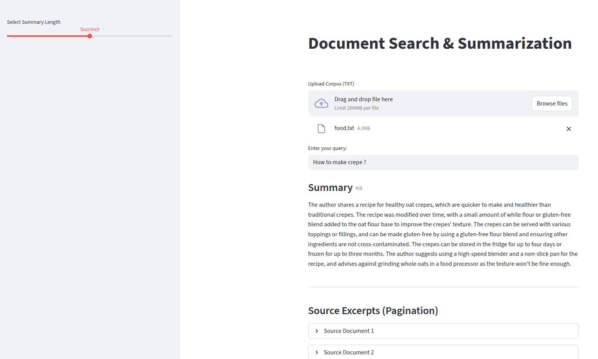

# Document Search and Summarization System (RAG)

## 1. Project Overview

This project implements a high-efficiency system designed to search and summarize vast amounts of textual data using Large Language Models (LLMs). By leveraging a **Retrieval-Augmented Generation (RAG)** architecture, the system ensures that summaries are grounded in specific retrieved context, providing accurate and succinct information to the user.

## 2. Key Features

**Hybrid Search Mechanism:** Combines traditional information retrieval (BM25) with semantic LLM embeddings to maximize search accuracy.
**Adjustable Summarization:** Users can specify the desired length of the summary (e.g., short, medium, or detailed).
**Intelligent Interface:** Features a user-friendly UI with auto-suggestion for queries and pagination for search results.
**Automated Evaluation:** Integrated suite for measuring search relevance and summary quality using ROUGE scores.


---

## 3. Methodology

### Data Preparation & Cleaning

The pipeline ingests a corpus and performs the following pre-processing steps:
**Cleaning:** Removal of noise and normalization of text to make it suitable for search.
**Chunking:** Documents are split into optimized segments using a `RecursiveCharacterTextSplitter` to manage LLM context windows and improve search granularity.

### Document Search (Hybrid Retrieval)

To ensure the top N most relevant documents are returned, the system employs an **Ensemble Retriever**:

1. **BM25 (Traditional):** Effective for keyword matching and specific technical terms.
2. **Vector Store (Semantic):** Uses embeddings to find documents based on meaning and context rather than just keyword overlap.


### Summarization

Retrieved excerpts are passed to an LLM (e.g., GPT-4) with a specific system prompt. The LLM is instructed to synthesize a coherent summary that captures the "essence" of the returned documents while adhering to the user's requested length.

---

## 4. Setup & Installation



### Prerequisites

* Python 3.9+
* OpenAI API Key (or equivalent LLM provider)

### Installation

1. **Clone the repository:**
2. **Install dependencies:**
```bash
pip install -r requirements.txt

```
3. **Set Environment Variables:**
```bash
export OPENAI_API_KEY='your_api_key_here'

```
4. **Run the Application (Local Interface):**
```bash
streamlit run app.py

```
---

## 5. Evaluation Procedure

As required by the assignment, the system includes an evaluation module:
 
**Test Set Creation:** A subset of the corpus is used to generate synthetic queries designed to ideally return a specific document.
**Search Accuracy:** Measured by the system's ability to retrieve the correct document for the synthetic queries.
**Summary Quality:** Evaluated using **ROUGE scores** (automated) and guidelines for human evaluation to ensure coherence and accuracy.

---

## 6. Scalability & Efficiency

**Indexing:** The use of FAISS (Facebook AI Similarity Search) allows the system to scale to even larger datasets while maintaining low latency.
**Resource Optimization:** The architecture minimizes LLM calls by filtering data through efficient indexing methods first.


## 7. Evaluation Logic

A core requirement of the task is measuring performance using automated metrics like ROUGE scores.
To run the evaluation, 
```bash
python run_evaluator.py

```

### Performance Interpretation Logic

The codebase includes an interpretation engine that evaluates the **ROUGE-1** (Keyword Capture) and **ROUGE-L** (Structural Coherence) results to categorize system performance:

```python
# Performance Classification Logic
if r1_score > 0.35 and rl_score > 0.20:
    status = "GOOD PERFORMANCE"
    detail = "High keyword capture and strong paraphrasing power."
elif r1_score > 0.20:
    status = "AVERAGE PERFORMANCE"
    detail = "The system finds the right content but needs better synthesis."
else:
    status = "POOR PERFORMANCE"
    detail = "The retrieval or prompt logic requires significant tuning."

```

### Analysis of Current Results

Based on testing with the `tempt.txt` dataset:

* **ROUGE-1 (0.3956)**: Indicates **High Keyword Capture**. The system successfully identifies key ingredients and terms.


* **ROUGE-L (0.2370)**: Indicates **Strong Paraphrasing Power**. The LLM is summarizing and restructuring the text effectively rather than just extracting it verbatim.


